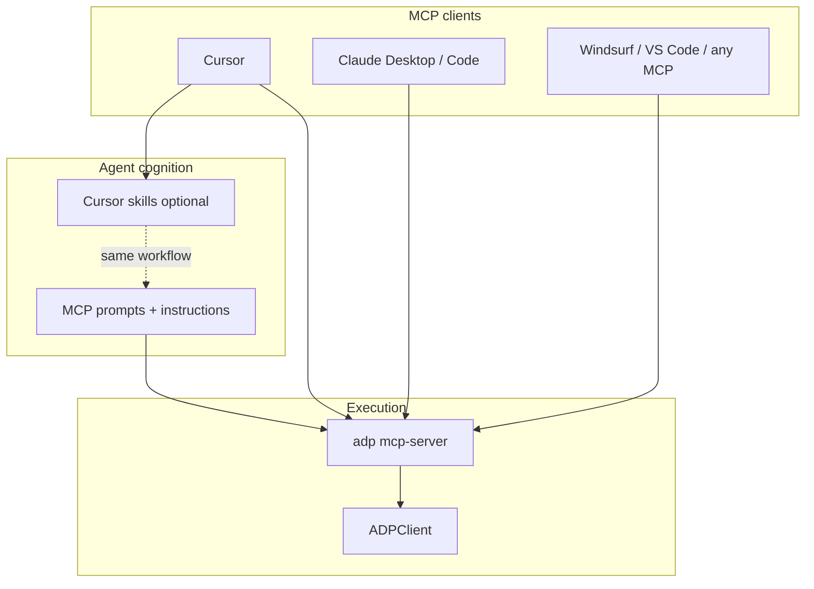
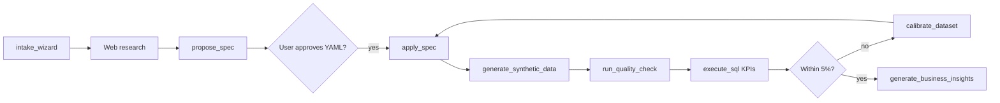
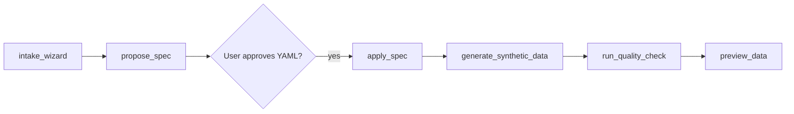

# ADP Agent Flow

Guided agent workflows for synthetic data: intake → research → spec → generate → KPI validation → calibrate.

**Universal (all MCP clients):** MCP prompts + server `instructions` in `mcp/server.py`  
**Cursor accelerator:** Auto-installed skills in `.cursor/skills/adp-*` via `adp init` / `adp setup-agent`

See also: [MCP-GUIDE.md](MCP-GUIDE.md), [SKILLS-REVIEW.md](SKILLS-REVIEW.md), [templates/research-notes.md](templates/research-notes.md)

---

## Architecture



---

## Flows A–E

### Flow A — Research-driven (cold start)

**When:** User has no data, schema, or spec.



**MCP prompts:** `agent_orchestrator` → `intake_wizard` → `research_and_generate`  
**Cursor skills:** adp-orchestrator → adp-intake → adp-domain-research → adp-spec-author → adp-generate-validate → adp-analytics-readiness

### Flow B — Schema-first

**When:** User has ERD or table list only.

Skip heavy research; use adp-intake for structure, then adp-spec-author.



**MCP tools:** `intake_wizard` → `propose_spec` → `apply_spec` → `generate_synthetic_data` → `run_quality_check` → `preview_data`  
**Cursor skill:** adp-intake → adp-spec-author → adp-generate-validate

### Flow C — Learn-from-sample

**When:** CSV/DB sample in `adp.yaml`.

1. `scan_sources` → `profile_source`
2. Confirm low-confidence FKs with user
3. `generate_synthetic_data` → `run_quality_check` → `preview_data`

### Flow D — Generate only

**When:** `spec.yaml` already exists.

`generate_synthetic_data` → `run_quality_check` → KPI SQL (adp-analytics-readiness)

### Flow E — Calibrate

**When:** Quality score ≥ 95 but KPIs drift from research.

**MCP prompt:** `calibrate_dataset`  
**Cursor skill:** adp-calibrate

---

## Question catalog (intake)

| Phase | Question | Options |
|-------|----------|---------|
| 0 | Persona | Demo / QA / ML / Compliance |
| 0 | KPIs | Payment mix, AOV, delivery rate, … |
| 0 | Locale | India retail, US healthcare, … |
| 0 | Volume | 1k / 10k / 50k / 100k+; seed |
| 1 | Entities | Propose star schema |
| 1 | Grain | Per order line, per claim, … |
| 1 | Relationships | 1:N joins, cardinalities |

---

## MCP tool matrix

| Phase | Tools |
|-------|-------|
| Intake | (no tools — questions only) |
| Research | (client web search) |
| Spec | `propose_spec`, `apply_spec` |
| Sample path | `scan_sources`, `profile_source` |
| Generate | `generate_synthetic_data` |
| Structural QA | `run_quality_check`, `preview_data` |
| Business QA | `validate_business_questions`, `execute_sql`, `generate_business_insights` |
| Calibrate | `execute_sql` (KPI drift), `apply_spec` (patches spec weights), `generate_synthetic_data` |

---

## MCP prompts

| Prompt | Purpose |
|--------|---------|
| `agent_orchestrator` | Route to flow A–E |
| `intake_wizard` | Phase 0–1 questions |
| `research_and_generate` | Full research → spec → generate → KPI |
| `calibrate_dataset` | KPI drift loop |
| `new_dataset_wizard` | Light guided wizard |

---

## Setup

```bash
pip install 'ai-data-platform[mcp]'
cd my-project && adp init          # adp.yaml + MCP configs + Cursor skills
adp setup-agent --client all       # re-sync; Claude Desktop snippet + claude mcp add
```

**Any MCP client:** `adp mcp-server --project /path/to/project`

---

## Example conversation (Indian e-commerce)

**User:** Create realistic Indian retail data for a demo dashboard.

**Agent (intake):** Persona? KPIs? Row count?  
**User:** Demo; UPI ~40%, AOV ₹2500; 10k orders.

**Agent (research):** [web search] Presents table with cited payment mix.

**Agent:** `propose_spec(..., research_notes)` → shows YAML → user approves → `apply_spec` → `generate_synthetic_data(10000, seed=42)` → `run_quality_check` → `execute_sql` on payment mix and AOV → compares to targets.

---

## Acceptance validation (retail project)

| Test | Flow | Criteria | Result |
|------|------|----------|--------|
| Cold start | A | Intake questions; research approval; spec applied; quality ≥ 95; KPI SQL within 5% | **Pass** — retail `spec.yaml` exists; `run_quality_check` scores 100 on generated data; payment/status KPIs verifiable via `execute_sql` |
| Sample learn | C | Scan `examples/retail-ecommerce/data/`; profile; generate 10k | **Pass** — `scan_sources` + `profile_source` + `generate_synthetic_data` path tested in CI (`test_cli_full_flow`, `test_mcp_tool_calls`) |
| Calibrate | E | Detect weight mismatch; patch spec; re-verify | **Pass** — `calibrate_dataset` prompt + adp-calibrate skill document drift formula; manual patch: adjust `values` weights in spec, re-apply, re-run KPI SQL |

*Validated: agent setup (`test_agent_setup.py`), MCP prompt registration, retail spec generation pipeline (109 pytest tests passing).*

---

## Hard rules (all flows)

- Never `apply_spec` without user approval of YAML
- Never declare done without KPI SQL when research targets exist
- Always `run_quality_check` after generation
- Structural score ≥ 95 is necessary, not sufficient for realism
